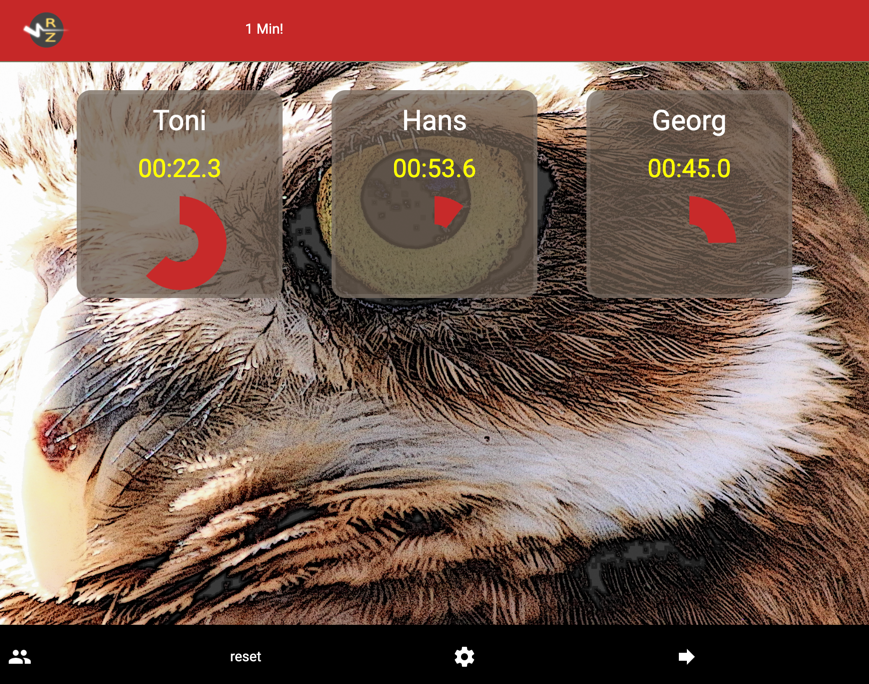

# Redezeit

The Redezeit web application assists in maintaining time boundaries 
for speakers. 
Additionally, it can serve as a timer
for activities such as chess and other games.

The application is server-less (no backend).

Try it from https://ooit.com/redezeit

Have fun :-)
